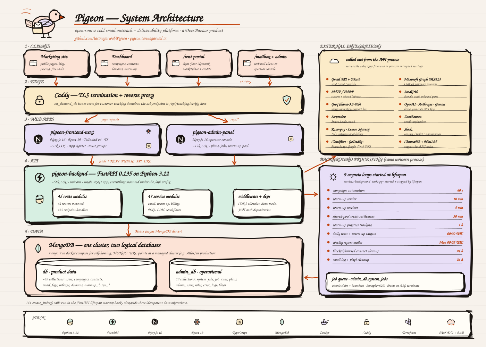

# Pigeon — Architecture



---

## 1. Overview

**Pigeon** is an open-source cold email outreach and deliverability platform. It is a
[DevsBazaar](https://devsbazaar.com) product, open sourced at
<https://github.com/tarinagarwal/Pigeon> and run as a hosted instance at
<https://pigeon.tarinagarwal.in>.

The product covers the whole outbound lifecycle in one system:

- **Sending infrastructure** — connect Gmail (OAuth), Outlook/Microsoft 365, or arbitrary
  SMTP/IMAP mailboxes; buy and configure sending domains and subdomains with SPF/DKIM/DMARC
  written straight into your DNS provider.
- **Deliverability** — an inbox warm-up engine that sends, opens, un-spams and replies to mail
  on a 30-day ramp, plus per-campaign inbox-placement checks.
- **Campaigns** — contacts and lists, templates (plain, HTML, and a WYSIWYG builder), sequenced
  campaigns executed by a job queue, open/click/reply tracking on customer-owned tracking domains.
- **Lead sourcing and AI** — Smart Leads (Serper.dev-backed company/person/email discovery),
  AI copy generation through a bring-your-own-key LLM layer, an outreach chat assistant, and a
  RAG support bot.
- **Rent Your Network (`/rent`)** — a marketplace portal where users lend their contact network to
  the warm-up pool and earn credits.
- **Webmail (`/mailbox`)** — a lightweight mail client for mailboxes provisioned through Pigeon.
- **Operator console** — a separate Next.js admin panel for plans, billing webhooks, system jobs,
  the shared warm-up receiver pool, error logs, and blog content.

> **Licensing.** Pigeon is released under the [MIT License](LICENSE) — Copyright (c) 2026 Tarin
> Agarwal.

---

## 2. Tech stack

Versions below are taken from `pigeon-backend/requirements.txt`, the two `package.json` files, the
`Dockerfile`s, `docker-compose.yml` and `infrastructure/terraform/`.

### Backend — `pigeon-backend/`

| Concern | Choice | Version |
| --- | --- | --- |
| Language / runtime | Python (`python:3.12-slim` base image) | 3.12 |
| Web framework | FastAPI | 0.135.3 |
| ASGI toolkit / server | Starlette · uvicorn | 1.0.0 · 0.25.0 |
| Validation | Pydantic (+ `pydantic-core`) | 2.12.5 |
| Database driver | Motor (async) over PyMongo | 3.3.1 · 4.5.0 |
| JWT | `python-jose` (also `PyJWT` installed) | 3.5.0 · 2.10.1 |
| Password hashing | `passlib[bcrypt]` + `bcrypt` | 1.7.4 · 4.0.1 |
| Credential encryption | `cryptography` (Fernet) | `>=2.5,<46` |
| HTTP clients | `httpx` · `aiohttp` · `requests` | 0.28.1 · 3.13.3 · 2.32.5 |
| Google APIs / OAuth | `google-api-python-client` · `google-auth-oauthlib` | 2.187.0 · 1.2.4 |
| Microsoft OAuth | `msal` | 1.31.0 |
| AWS SDK | `boto3` (ASG lifecycle + infra routes only) | 1.42.21 |
| Spreadsheets | `openpyxl` | 3.1.5 |
| Support-bot RAG | `chromadb` · `sentence-transformers` · CPU `torch` · `groq` | 0.5.4 · 3.0.1 · 2.4.1 · 1.0.0 |
| DNS / email utils | `dnspython` · `email-validator` | 2.8.0 · 2.3.0 |
| Tests / tooling | `pytest` · `black` · `flake8` · `mypy` · `isort` | 9.0.2 · 25.12.0 · 7.3.0 · 1.19.1 · 7.0.0 |

`requirements.txt` is a frozen environment, so a few pinned packages (`stripe`, `litellm`,
`dkimpy`, `pandas`, `Jinja2`, `tiktoken`) have no `import` anywhere in the source tree.

### Frontend — `pigeon-frontend-next/`

| Concern | Choice | Version |
| --- | --- | --- |
| Framework | Next.js (App Router, standalone output) | 16.1.6 |
| UI runtime | React · React DOM | 19.2.3 |
| Language | TypeScript | ^5 |
| Styling | Tailwind CSS v4 via `@tailwindcss/postcss` + `tailwindcss-animate` | ^4 |
| Primitives | Radix UI (24 packages), `cmdk`, `vaul`, `sonner` | — |
| Server state | TanStack React Query | ^5.83.0 |
| Forms | `react-hook-form` + `zod` via `@hookform/resolvers` | ^7.61 · ^3.25 |
| Rich text / email builder | TipTap 3 · GrapesJS (+ newsletter preset) · `juice` | ^3.20 · ^0.21 · ^11.1 |
| Charts / flow | Recharts · React Flow | ^2.15 · ^11.11 |
| Motion / onboarding | `framer-motion` · `driver.js` | ^12.29 · ^1.4 |
| Direct DB access (RSC + route handlers) | `mongodb` Node driver | ^7.1.0 |
| Media | `cloudinary` | ^2.9.0 |
| Build image | `node:20-alpine`, multi-stage | — |

### Admin panel — `pigeon-admin-panel/`

Next.js 16.1.6, React 19.2.3, TypeScript ^5, Tailwind v4, a small Radix subset, and `axios` for
API calls. No direct database access — it talks only to the FastAPI API.

### Infrastructure — `infrastructure/`

| Concern | Choice |
| --- | --- |
| Containers | Docker, Docker Compose v2 (`docker-compose.yml`) |
| Database image (self-host) | `mongo:7` |
| Edge / TLS | Caddy with `on_demand_tls` (`infrastructure/caddy/Caddyfile`) |
| IaC | Terraform `>= 1.0`, `hashicorp/aws ~> 5.0` |
| CI/CD | GitHub Actions (`.github/workflows/deploy-backend-asg.yml`) → ECR → ASG instance refresh |

---

## 3. Monorepo layout

```
.
├── docker-compose.yml            # mongo + backend + frontend + admin, one command
├── .env.example                  # compose-level knobs (ports, MONGO_URL, NEXT_PUBLIC_* )
├── README.md · SECURITY.md · CODE_OF_CONDUCT.md
├── .github/workflows/
│   └── deploy-backend-asg.yml    # build → ECR → ASG instance refresh
│
├── pigeon-backend/               # FastAPI service (~58k LOC of Python)
│   ├── server.py                 # app factory, lifespan, index creation, router mounting
│   ├── database.py               # Motor client; exposes `db` and `admin_db`
│   ├── config.py                 # retention/cleanup constants
│   ├── models.py · admin_models.py
│   ├── routes/                   # 45 modules — 42 mounted routers + auth_utils/dependencies/schemas
│   ├── services/                 # 47 modules + services/support-bot/ (RAG package)
│   ├── scripts/                  # 13 one-off migration / cleanup scripts
│   ├── tests/                    # 7 pytest modules
│   └── Dockerfile
│
├── pigeon-frontend-next/         # marketing + app + /rent + /mailbox (~97k LOC TS/TSX/CSS)
│   ├── app/
│   │   ├── (marketing)/          # landing, features, pricing, contact
│   │   ├── (auth)/               # login, signup, password reset
│   │   ├── (app)/                # authenticated dashboard: campaigns, contacts, domains,
│   │   │                         #   inboxes, warmup, workflows, analytics, tracking, …
│   │   ├── rent/                 # Rent-Your-Network portal (marketplace, credits, withdraw)
│   │   ├── mailbox/              # webmail login / password flows
│   │   └── api/                  # Next route handlers: blogs, plans, contact, track, upload…
│   ├── components/ · hooks/ · contexts/ · lib/ · types/
│   └── Dockerfile
│
├── pigeon-admin-panel/           # operator console (~17k LOC TS/TSX/CSS)
│   ├── app/admin/                # plans, jobs, warm-up pool, error logs, blogs, billing
│   └── Dockerfile
│
└── infrastructure/
    ├── caddy/                    # Caddyfile + README for on-demand TLS tracking proxy
    ├── terraform/                # AWS: VPC lookup, SG, ALB, ASG/EC2, ECR, IAM
    ├── script.sh · commands      # ASG lifecycle-hook release helpers
    └── update-ssm-env.sh         # push backend .env into SSM Parameter Store
```

---

## 4. Request lifecycle

### 4.1 A dashboard page load

```
Browser
  → Caddy / ALB (TLS)                         443, HTTP→HTTPS
  → Next.js server (pigeon-frontend-next)     React Server Components render the shell
  → browser hydrates, client components fetch `${NEXT_PUBLIC_API_URL}/...`
  → FastAPI (pigeon-backend), every path under the `/api` prefix
  → Motor → MongoDB
```

`NEXT_PUBLIC_API_URL` is inlined at image build time (it is a `docker-compose.yml` build arg), so
the browser talks to the API directly rather than through the Next.js server for app data.

### 4.2 What the FastAPI request actually passes through

1. **CORS middleware** — origins come from `CORS_ORIGINS` (default `http://localhost:8080,
   http://localhost:3000`), credentials allowed, with an explicit header allowlist that includes
   `Authorization`, `X-Timezone`, `X-Demo-Mode`, `If-None-Match`, `X-Workspace-Context`.
2. **`demo_mode_middleware`** — when `?demo=1`, `X-Demo-Mode: 1`, or `user_id=demo-user` is
   present it short-circuits `OPTIONS /api/*` preflights and synthesises a demo user for
   `GET /api/auth/me`, so demo sessions never reach real handlers.
3. **Router dispatch** — one `APIRouter(prefix="/api")` aggregates 42 routers; there are 435
   endpoint handlers across `routes/`. FastAPI's own `/docs` and `/redoc` are disabled.
4. **Auth dependency** — `get_current_user`, `get_current_mailbox`, `get_current_admin`,
   `get_current_super_admin`, or `require_admin_permissions([...])` (see §9).
5. **Service layer** — handlers delegate to the singletons wired up in `server.py`
   (`EmailService`, `GmailService`, `SMTPService`, `DomainService`, `PlanService`,
   `AutomationService`, `WorkflowService`, warm-up services, …).
6. **Motor** — async reads/writes against `db` or `admin_db`.

`GET /` on the API host is a 307 redirect to `FRONTEND_URL`.

### 4.3 Two paths that skip the API

- **Next.js server-side data.** `pigeon-frontend-next/lib/mongodb.ts` opens its own cached
  `MongoClient`. Blog content (`lib/blog-data.ts`), plan data (`lib/plan-data.ts`) and
  `app/api/contact`, `app/api/plans` read Mongo directly from the Next server for marketing pages.
- **Legacy link proxying.** `lib/backend-proxy.ts` forwards paths such as
  `/api/lifecycle/unsubscribe/...` that were minted against the marketing origin to the API origin.

### 4.4 Tracking traffic

Open pixels and click links resolve on `TRACKING_BASE_URL` (or a customer's own domain CNAME'd to
`TRACKING_CNAME_TARGET`). Caddy terminates TLS for those hostnames using on-demand certificates and
reverse-proxies to the API, keeping `Host` pinned upstream because backend routing is path-based.
Before issuing a certificate Caddy calls
`GET /api/tracking/verify-host?domain=<host>` with the `X-Tracking-Proxy-Secret` header
(`TRACKING_PROXY_SHARED_SECRET`); the endpoint returns 200 only for verified customer domains.

---

## 5. Data layer

`database.py` creates a single `AsyncIOMotorClient` from `MONGO_URL` and exposes **two logical
databases** on that one cluster:

| Handle | Env var | Purpose |
| --- | --- | --- |
| `db` | `DB_NAME` (required) | product data — everything a tenant owns |
| `admin_db` | `ADMIN_DB_NAME` (optional) | operational data — admin users, jobs, plans, logs |

If `ADMIN_DB_NAME` is unset, `admin_db` falls back to `db` and a warning is logged; production is
expected to set it so operational data is isolated.

**`db` — roughly 69 collections referenced in code**, including:

| Area | Collections |
| --- | --- |
| Identity | `users`, `sessions`, `password_resets`, `email_verification_codes`, `user_settings`, `sub_user_invitations`, `registration_rate_limits` |
| Sending assets | `inboxes`, `gmail_credentials`, `oauth_states`, `domains`, `subdomains`, `domain_creation_locks`, `reply_to_imap_configs` |
| Audience | `contacts`, `contact_lists`, `campaign_contacts`, `contact_submissions` |
| Campaigns | `campaigns`, `templates`, `email_logs`, `tracking_pixels`, `link_clicks`, `campaign_deliverability_checks/state/runs`, `campaign_enrichment_leads` |
| Inbound | `inbound_messages`, `outbound_replies`, `mailbox_password_resets`, `webhooks` |
| Warm-up | `warmup_sent`, `warmup_threads`, `warmup_messages`, `warmup_send_templates`, `warmup_network_contacts`, `warmup_network_email_otps`, `warmup_close_network_events` |
| Rent Your Network | `ryn_users`, `ryn_listings`, `ryn_transactions`, `ryn_withdrawals`, `ryn_email_otps` |
| Credits & billing | `credit_transactions`, `credit_topups` |
| Automation | `workflows`, `workflow_runs`, `workflow_run_steps`, `workflow_waits`, `workflow_email_intents`, `lifecycle_journeys`, `lifecycle_email_sends`, `lifecycle_events`, `lifecycle_suppressions` |
| AI | `llm_configs`, `outreach_chats`, `outreach_chat_messages`, `smart_leads_runs/companies/people/emails`, `risky_email_jobs` |
| Support | `tickets`, `ticket_comments`, `alerts`, `alert_read_status`, `alert_dismissed`, `notification_logs`, `public_placement_tests` |

**`admin_db` — 19 collections:** `admin_users`, `admin_user_roles`, `admin_permissions`,
`role_permissions`, `audit_logs`, `automation_rules`, `system_jobs`, `job_runs`, `plans`, `blogs`,
`error_logs`, `billing_webhook_logs`, `feature_flags`, `system_configs`, `support_bot_cache`,
`warmup_receiver_accounts`, `warmup_reply_templates`, `gmail_receiver_oauth_states`,
`outlook_receiver_oauth_states`.

### Startup work

The FastAPI `lifespan` context runs **144 `create_index()` calls** across both databases before
serving traffic. Notable patterns:

- **TTL indexes** for self-expiring state: `oauth_states` and the two receiver OAuth-state
  collections (1 h), `domain_creation_locks` (5 min), `password_resets` /
  `mailbox_password_resets` / `ryn_email_otps` / `public_placement_tests` (`expireAfterSeconds=0`
  on an explicit `expires_at`).
- **Uniqueness guards** such as `users.email`, `domains.domain_normalized` (sparse),
  `lifecycle_email_sends.idempotency_key`, and `warmup_receiver_accounts` on `(email, provider)`.
- **A partial unique index** on `admin_db.system_jobs` over `action_config.domain_id` restricted to
  `{job_type: "dns_verify_domain", status: "pending"}` — this is what makes multi-instance job
  scheduling safe.
- **Compound read paths**, e.g. the inbox listing index
  `(user_id, status, archived, replied_at desc, sent_at desc)`.

Three idempotent migrations also run at startup: `_migrate_gmail_credentials_to_multi()`,
`_migrate_warmup_send_templates_to_paired()` and `_backfill_domain_normalized()`. Index creation is
wrapped in `try/except` so a failure logs but does not block boot.

---

## 6. Background processing

All background work runs **in the same uvicorn process** as the API — there is no Celery, no
separate worker image. `BackgroundTasks.start()` is called from the lifespan hook and spawns nine
`asyncio` tasks, unless `SKIP_BACKGROUND_TASKS` is truthy.

| # | Loop | Cadence | What it does |
| --- | --- | --- | --- |
| 1 | `_automation_loop` | 60 s | Drives the `system_jobs` queue: campaign batches, DNS verification, workflow steps |
| 2 | `_warmup_sender_loop` | 10 min | Sends warm-up mail from warming inboxes (`max_sends_per_inbox_per_run=3`) |
| 3 | `_warmup_receiver_loop` | 5 min | Opens warm-up mail, moves it out of spam, replies (`max_replies_per_account_per_run=2`) |
| 4 | `_shared_pool_credit_settlement_loop` | 30 min | Rewards contact owners on qualifying replies; refunds senders after the 48 h hold |
| 5 | `_warmup_tracking_loop` | 1 h | Recomputes `warmup_progress` per warming inbox, 0.5 s apart to avoid a DB thundering herd |
| 6 | `_daily_reset_loop` | 00:00–00:05 UTC | Resets `sent_today` on every inbox, then runs the warm-up midnight tasks |
| 7 | `_weekly_report_loop` | Mondays 00:05 UTC | Sends weekly sent/opened/replied digests to users who opted in |
| 8 | `_blocked_contacts_cleanup_loop` | 24 h (`BLOCKED_CONTACT_CLEANUP_INTERVAL_HOURS`) | Deletes long-blocked and long-unused contacts |
| 9 | `_email_logs_cleanup_loop` | 24 h (`EMAIL_LOG_CLEANUP_INTERVAL_HOURS`) | Prunes stale `email_logs`, `tracking_pixels`, `inbound_messages` |

Loops 2 and 4 only start if a `WarmupSenderService` was injected, loop 3 only with a
`WarmupReceiverService`, and loop 1 only with an `AutomationService`. Every loop catches and logs
exceptions, re-raises `asyncio.CancelledError`, and backs off (usually 300 s) on failure so one bad
tick cannot kill the task.

### The job queue

`admin_db.system_jobs` is the durable queue; `admin_db.job_runs` records executions. Job types in
the tree: `send_campaign_batch`, `dns_verify_domain`, `workflow_step`.

- **Atomic claiming.** Jobs are claimed with a conditional update so several instances can share the
  queue; a heartbeat is written while a job runs.
- **Bounded concurrency.** `asyncio.Semaphore(MAX_CONCURRENT_CAMPAIGN_BATCHES)`, default **20**,
  caps parallel campaign batches per process.
- **Stuck-job recovery.** `HEARTBEAT_STALE_MINUTES` (default 5) reclaims jobs whose process died;
  `STALE_RUNNING_JOB_HOURS` (default 24) fails jobs that never finish;
  `STALE_CAMPAIGN_AUTO_RESTART_HOURS` stops and reschedules long-running campaign batches.

### Graceful drain

Two independent signals stop an instance from claiming *new* work while letting in-flight jobs
finish:

- the presence of the file at `INSTANCE_TERMINATING_FILE` (default `/signals/instance-terminating`),
  written on the host by the ASG termination handler — the EC2 bootstrap creates
  `/opt/pigeon/signals` for exactly this; and
- a `boto3` `describe_auto_scaling_instances` check for `LifecycleState == "Terminating:Wait"`.

When either is true the loop logs *"Instance is terminating (draining): skipping new job claims"*
and no further jobs are claimed. On shutdown, `lifespan` calls `background_tasks.stop()` (which
flips `self.running`, so each loop exits at its next checkpoint) and then closes the Mongo client.

---

## 7. The warm-up engine

Warm-up is the deliverability core, spread across `warmup_sender_service.py` (2,387 LOC),
`warmup_receiver_service.py` (1,627 LOC), `warmup_llm_service.py`, `warmup_inbound_sync.py` and
`warmup_shared_pool_service.py`.

### Sending side

Warming inboxes send to the platform's shared receiver pool (`admin_db.warmup_receiver_accounts`,
Gmail or Outlook accounts connected by operators) and — when enabled — to real addresses lent by
other users through the Rent-Your-Network pool.

Human-like pacing is deliberate: 25–65 s between sends, 2–8 s between inboxes, at most 80 inboxes
per 10-minute cycle, and three synthetic personas (`early_bird`, `office_worker`, `night_owl`) with
their own active-hours windows, drop rates and reply gaps.

### Multi-turn threading

With `WARMUP_MULTITURN_ENABLED` (default on), a send is not a one-shot message. `warmup_threads`
holds a conversation per `(inbox_id, receiver_account_id)` with a `stage` of `new`, `active` or
`cooldown` and a `next_action_at` timestamp; `warmup_messages` holds each turn. The sender looks for
an existing thread in an eligible stage whose `next_action_at` has passed, continues it in-place
(reusing the thread's `thread_id`), and re-schedules `next_action_at` — otherwise it opens a new
thread. Bodies are generated by Groq (`WARMUP_GROQ_ENABLED`, `WARMUP_GROQ_MODEL`, default
`llama-3.3-70b-versatile`, bounded by `WARMUP_GROQ_TIMEOUT_MS`) with a static neutral
subject/body pool as the fallback.

### Receiving side

The receiver loop signs into pool accounts, **moves warm-up mail out of spam**, opens it, and replies
from `admin_db.warmup_reply_templates`, reporting `moved_from_spam` / `opened` / `replied` counts per
run. Inbound replies are matched back to `warmup_sent` by `message_id` / `thread_id`.

### Pairing risk scoring — "close network" modes

To stop the warm-up graph from collapsing into an obviously synthetic clique,
`_score_close_network_candidate()` scores every (sender, receiver) pair before a send:

| Signal | Weight | Trips when |
| --- | --- | --- |
| `pair_repeat_risk` | 0.45 | The same pair sent within `WARMUP_CLOSE_NETWORK_PAIR_COOLDOWN_DAYS` (default 5) |
| `reciprocity_risk` | 0.20 | Back-and-forth count within the reciprocity window (default 7 days) hits `..._RECIPROCITY_CAP` (default 3) |
| `provider_concentration_risk` | 0.20 | 24 h sends to one provider approach `..._PROVIDER_DAILY_CAP` (default 8) |
| `domain_concentration_risk` | 0.15 | 24 h sends to one root domain approach `..._DOMAIN_DAILY_CAP` (default 4) |

The weighted score is clamped to `[0, 1]` and compared against
`WARMUP_CLOSE_NETWORK_RISK_THRESHOLD` (default `0.65`). `WARMUP_CLOSE_NETWORK_MODE` (default
`shadow`) then decides what to do with it:

| Mode | Behaviour |
| --- | --- |
| `off` | Score computed and returned, never enforced |
| `shadow` | Never blocks; sets `shadow_block` when the score crosses the threshold, and logs how many sends *would* have been blocked |
| `high_confidence` | Blocks only on the unambiguous signal — pair cooldown (`pair_repeat_risk == 1.0`) |
| *(anything else, i.e. `full`)* | Blocks whenever `score >= threshold` |

The intended rollout is `shadow → high_confidence → full`, and `routes/admin_warmup.py` exposes a
readiness endpoint that compares the observed shadow rejection rate against
`WARMUP_CLOSE_NETWORK_ALERT_REJECTION_RATE` (default 0.25) before recommending the next step.
`WARMUP_CLOSE_NETWORK_MIN_CANDIDATES_PER_CYCLE` keeps a floor of candidates so scoring cannot
starve an inbox. `scripts/replay_close_network_shadow.py` replays historical events offline.

Per-recipient protection also exists independently: each network address may receive at most
`DEFAULT_WARMUP_NETWORK_CONTACT_DAILY_LIMIT` (20, tunable 1–100) warm-up emails in a rolling 24 h
window across all of an owner's inboxes.

### Engagement targets

At midnight UTC, `_warmup_midnight_tasks()` writes the day's cap and engagement targets onto every
`status: "warming"`, `auto_warmup: true` inbox from a 30-day authored plan, in four phases:

| Phase | Days | Daily cap (at a 50/day goal) | Target open rate | Target reply rate |
| --- | --- | --- | --- | --- |
| 1 — gentle start | 1–7 | 5 → 20 | 1.00 → 0.92 | 0.60 → 0.45 |
| 2 — build consistency | 8–15 | 22 → 40 | 0.95 → 0.88 | 0.45 → 0.35 |
| 3 — natural behaviour | 16–23 | 42 → 50 | 0.90 → 0.83 | 0.35 → 0.28 |
| 4 — steady state | 24–30 | 50 | 0.85 → 0.78 | 0.28 → 0.20 |

Counts are authored against a 50/day baseline and scaled linearly to each inbox's
`warmup_daily_limit_goal`. Engagement deliberately *decays* over the ramp so a matured inbox looks
like a real mailbox rather than one with a suspicious 100 % open rate.

> Note for maintainers: `_compute_warmup_day_index()` returns `min(7, max(1, days_since_start + 1))`,
> so in its current form the day index saturates at 7 and only phase 1 of the table above is ever
> selected. The full table is present and used by `_compute_warmup_targets_for_day()`.

### Shared pool credits

Sends that consume another user's lent contacts hold credits for
`SHARED_POOL_CREDIT_HOLD_HOURS` (48). The settlement loop (§6, loop 4) rewards the contact owner if
a qualifying reply arrives and refunds the sender otherwise.

---

## 8. Integrations

Everything below is called server-side from the API process. Keys come from environment variables,
or — where marked BYO — from per-user values in `user_settings`, Fernet-encrypted at rest.

| Service | Used for | Required configuration |
| --- | --- | --- |
| Google OAuth + Gmail API | Connecting user Gmail mailboxes; `gmail.send`, `gmail.readonly`, `gmail.modify` scopes | `GOOGLE_CLIENT_ID`, `GOOGLE_CLIENT_SECRET`, `GOOGLE_REDIRECT_URI` |
| Gmail (warm-up receivers) | Operator-owned Gmail accounts in the shared warm-up pool | `GMAIL_RECEIVER_REDIRECT_URI` (falls back to `BACKEND_URL + /api/admin/warmup/gmail-receiver/callback`) |
| Microsoft Graph via MSAL | Outlook/M365 warm-up receiver accounts (`Mail.Read`, `Mail.ReadWrite`, `Mail.Send`, `User.Read`) | `MICROSOFT_CLIENT_ID`, `MICROSOFT_CLIENT_SECRET`, `MICROSOFT_REDIRECT_URI` |
| SMTP / IMAP | Arbitrary sending mailboxes, reply polling, app notifications | Per-inbox credentials (encrypted); `NOTIFICATION_SMTP_HOST/PORT/USERNAME/PASSWORD` for notifications |
| SendGrid | Domain authentication and Inbound Parse (receiving mail for customer domains) | `SENDGRID_API_KEY`, `SENDGRID_INBOUND_PARSE_URL`, optional `SENDGRID_INBOUND_VERIFY_TOKEN` |
| Groq | Warm-up reply generation and the support bot | `GROQ_API_KEY`, `WARMUP_GROQ_ENABLED`, `WARMUP_GROQ_MODEL`, `GROQ_MODEL` |
| OpenAI · Anthropic · Gemini · DeepSeek · Grok · Groq | BYO-key generation in `LLMService` (defaults `gpt-4o`, `claude-4-sonnet-20250514`, `gemini-2.5-pro`, `llama-3.3-70b-versatile`) | Per-user keys in `llm_configs` — no server env var |
| Serper.dev | Smart Leads Google search | per-user encrypted key, else `SERPER_API_KEY` |
| ZeroBounce | Email verification (`api.zerobounce.net/v2/validate`) | per-user encrypted `zerobounce_api_key_encrypted` |
| Razorpay | India subscriptions + webhooks | `RAZORPAY_KEY_ID`, `RAZORPAY_KEY_SECRET`, `RAZORPAY_WEBHOOK_SECRET`, `RAZORPAY_PLAN_*` |
| Lemon Squeezy | International subscriptions + webhooks | `LEMONSQUEEZY_API_KEY`, `LEMONSQUEEZY_STORE_ID`, `LEMONSQUEEZY_WEBHOOK_SECRET`, `LEMONSQUEEZY_VARIANT_*` |
| Slack | Bot pings for contact form, new ticket, new signup | `SLACK_BOT_TOKEN`, optional `SLACK_CHANNEL_CONTACT` / `_TICKET` / `_NEW_USER` |
| Cloudflare · GoDaddy · Namecheap · Google Cloud DNS | Writing SPF/DKIM/DMARC/CNAME records into the user's zone | Per-user provider credentials (encrypted); `NAMECHEAP_CLIENT_IP` for Namecheap; a service-account JSON for Cloud DNS |
| ChromaDB + sentence-transformers | Support-bot RAG index (persistent client under `services/support-bot/chroma_db`) | none — local, CPU-only torch |
| AWS (ASG + IMDS) | Drain detection and the admin infrastructure routes | `ASG_NAME`, `AWS_REGION`; instance IAM role on EC2 |
| Cloudinary / ImageKit | Blog and template image hosting | `CLOUDINARY_*`, `IMAGEKIT_*` |
| Email Infra API | External mailbox/domain provisioning | `EMAIL_INFRA_API_BASE_URL`, `EMAIL_INFRA_API_KEY`, `EMAIL_INFRA_DEFAULT_VPS_ID` |
| IP geolocation | Region detection for currency/billing routing | `IPGEOLOCATION_API_KEY` |

---

## 9. Security model

### Tokens

All JWTs are **HS256**, signed with a single shared `JWT_SECRET`, and default to a **7-day** life
(`JWT_EXPIRATION_HOURS = 24 * 7`). Four token shapes exist, distinguished by the `type` claim:

| `type` | Minted by | `sub` | Accepted by | Life |
| --- | --- | --- | --- | --- |
| *(absent → `"user"`)* | `create_access_token()` on login/signup | user id | `get_current_user` | 7 days |
| `admin` | `create_admin_access_token()` at `/api/admin/auth/login` | admin user id | `get_current_admin` | 7 days |
| `mailbox` | mailbox login; also carries `user_id` | inbox id | `get_current_mailbox` | 7 days |
| `impersonation` | `create_impersonation_token()` for admin support | user id | only `/api/auth/impersonate` | 1 hour |

User tokens additionally carry a `jti` tied to a row in `sessions`, with a unique index on
`(user_id, jti)` — this is what makes server-side session revocation possible. The auth cookie is
`Secure` when `COOKIE_SECURE=true`.

### Secrets at rest

- **Passwords** — bcrypt via `passlib` (`CryptContext(schemes=["bcrypt"])`), for both user and
  mailbox passwords.
- **Credentials** — `services/encryption_helper.py` wraps **Fernet** (symmetric AES-128-CBC +
  HMAC) keyed by `ENCRYPTION_KEY`, and refuses to run if the key is missing. It protects Gmail
  OAuth client secrets, SMTP/IMAP passwords, DNS provider API secrets, and per-user Serper /
  ZeroBounce keys. Read paths project these fields out of API responses. Losing `ENCRYPTION_KEY`
  makes every stored credential permanently unrecoverable — see `SECURITY.md`.

### Authorisation

- **Tenant isolation** — handlers filter by `user_id`; `verify_domain_ownership()` is the shared
  guard for domain-scoped routes. `sub_user_invitations` plus the `X-Workspace-Context` header back
  multi-seat workspaces.
- **Admin RBAC** — `require_admin_permissions([...])` is a dependency factory that resolves
  `admin_user_roles → role_permissions → admin_permissions` and requires the needed permission
  codes to be a subset of the admin's codes. `is_super_admin` short-circuits every check;
  `get_current_super_admin` gates admin-management routes.
- **Webhook verification** — Razorpay and Lemon Squeezy webhook signatures are checked, and every
  attempt (valid or not) is recorded in `admin_db.billing_webhook_logs` with a `signature_valid`
  flag and an index on it.
- **Other hardening** — `POST /admin/auth/create-admin` exists only when `ALLOW_DEV_CREATE_ADMIN`
  is set; the backend container runs as a non-root `appuser`; Mongo is not published to the host in
  `docker-compose.yml`; FastAPI's interactive docs are disabled in the app constructor.

---

## 10. Deployment topology

### Self-hosting — `docker compose up --build`

Four services on one compose network:

| Service | Image / build | Host port → container |
| --- | --- | --- |
| `mongo` | `mongo:7`, `mongo_data` volume, `mongosh` ping healthcheck | *not published* |
| `backend` | `./pigeon-backend` | `${BACKEND_PORT:-8001}` → 8000 |
| `frontend` | `./pigeon-frontend-next` | `${FRONTEND_PORT:-8080}` → 3000 |
| `admin` | `./pigeon-admin-panel` | `${ADMIN_PORT:-8082}` → 3000 |

`backend` waits on Mongo's healthcheck and has its own healthcheck against `/api/health`. Both
Next.js images take `NEXT_PUBLIC_API_URL` / `NEXT_PUBLIC_SITE_URL` as build args because
`NEXT_PUBLIC_*` values are inlined at build time.

### The hosted deployment — AWS

The Terraform in `infrastructure/terraform/` provisions **AWS**, not GCP:

- `provider "aws"`, default region **`us-east-1`**, default `project_name = "pigeon-backend"`,
  `environment = "production"`.
- **EC2 in an Auto Scaling Group** (`asg_min_size` 1, `asg_max_size` 10, desired 1), default
  instance type **`t3.small`**, Amazon Linux 2023, 30 GB root volume, launched from a launch
  template whose user-data is `bootstrap/docker-bootstrap.sh` (installs Docker + Compose v2,
  enables the SSM agent, creates `/opt/pigeon/signals`, pulls the backend `.env` from SSM
  Parameter Store at `/pigeon/backend/env_b64`).
- **An Application Load Balancer** in front (`enable_alb = true`), health-checking `/api/health`
  on port 8000; the instance security group only accepts the app port from the ALB's security
  group. HTTPS on the ALB is opt-in via `enable_https` + `acm_certificate_arn`.
- **ECR** for the backend image, **IAM** instance role (so no AWS keys land on disk), an optional
  Elastic IP, and an ASG **termination lifecycle hook** (`pigeon-backend-production-termination-hook`)
  that holds instances in `Terminating:Wait` while in-flight jobs drain.
- **CI/CD**: pushing to `main` triggers `.github/workflows/deploy-backend-asg.yml`, which builds the
  backend image with Buildx (registry cache), pushes `:${{ github.sha }}` and `:latest` to ECR, and
  starts an ASG instance refresh with a 45-minute cap.
- **Caddy** runs separately as the TLS edge for tracking hostnames, using on-demand certificates
  gated by the backend's verify-host endpoint (§4.4).
- **MongoDB** is external to the instance: `MONGO_URL` points at a managed cluster
  (`.env.example` names MongoDB Atlas as the production option); the bundled `mongo:7` service is
  for local and self-hosted use.

> The repository contains **no GCP/Compute Engine configuration**: there is no `google` Terraform
> provider, no `gcloud` tooling, and no reference to an `e2-standard-2` instance or the
> `asia-south1` region anywhere in the tree. Google Cloud appears only as *Google Cloud DNS*, one of
> four supported customer DNS providers, and as Google OAuth/Gmail. If the hosted instance has since
> migrated to GCE, that move is not reflected in this repository.

---

## 11. Diagram

The diagram embedded at the top of this file lives at
[`docs/architecture.svg`](docs/architecture.svg) and is included with:

```markdown

```

It is a single self-contained SVG — no external fonts, scripts, images, or network requests of any
kind — drawn with a `viewBox` of `0 0 1400 1000` and `width="100%" height="auto"` so it scales to
the container. It paints its own cream (`#F7F2EC`) background rect across the full canvas and never
relies on `currentColor`, so it renders identically under GitHub's light and dark themes.
